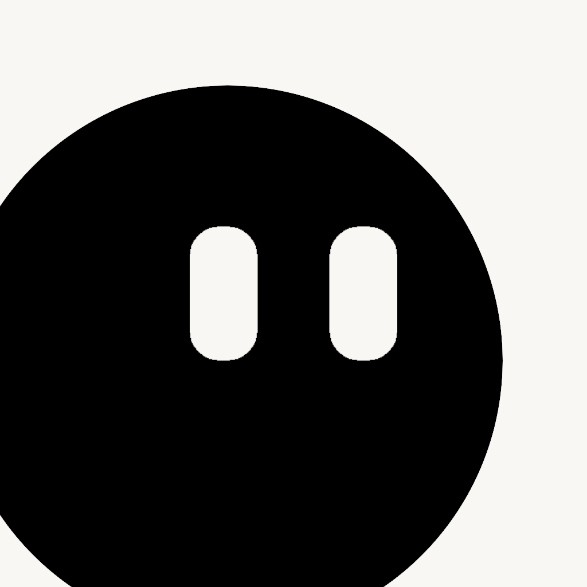

<p align="center">

</p>

<br/>

<h1 align="center"> 
 Mood Example
</h1> 

<p align="center">
 
<a target="_blank" href="https://flutter.dev/"></a> 
<a target="_blank" href="https://dart.dev/"></a> 
<a target="_blank" href="https://github.com/AmosHuKe/Mood-Example/blob/main/LICENSE"></a> 
</p> 


`情绪记录` 样例工程  
管理自己的情绪，记录当下所见所想，以及其他`实验室`功能  
运用 `Flutter` 的实践工程，主要目的是学习、实践。  
> 注意：由于是学习实践工程，所以重点在于学习，许多业务逻辑可能并不符合现实。  
> Emoji因设备缘故，会存在不同样式。  


## 🌏 相关网站

> Flutter官网（中文）：<a target="_blank" href="https://flutter.cn/">https://flutter.cn/</a>  
> Flutter官网（英文）：<a target="_blank" href="https://flutter.dev/">https://flutter.dev/</a>  
> Packages：<a target="_blank" href="https://pub.dev/">https://pub.dev/</a>  


## 🔖 功能

- [ ] 国际化  
- [ ] 多主题  
- [x] 深色模式  
- [x] 本地数据管理  
- [x] 路由管理  
- [x] 状态管理（MVVM）  
- [x] 情绪记录  
- [x] 图表统计    
- [ ] Excel 导入导出  
- [ ] 隐私解锁  
- [ ] 动画  
- [ ] 通知  
……


## 📱 测试运行环境

| 环境 | 支持版本 |  
| --- | --- |  
| Android | 最低：Android 5.0 (API 21) |  
| IOS | 未测试 |  


## 🛠️ 开发环境

```
[√] Flutter (Channel stable, 2.8.0, on Microsoft Windows [Version 10.0.22000.376], locale zh-CN)  
[√] Android toolchain - develop for Android devices (Android SDK version 31.0.0)  
[√] Android Studio (version 2020.3)  
[√] VS Code (version 1.63.2)  
```  


## 🎉 启动

在[开发环境](#%EF%B8%8F-%E5%BC%80%E5%8F%91%E7%8E%AF%E5%A2%83)支持的情况下  

```sh
# 拷贝项目
$ git clone https://github.com/AmosHuKe/Mood-Example.git

# 获取依赖
$ flutter pub get

# 启动项目 或 相关IDE启动
$ flutter run

# 更多启动模式
$ flutter run --Debug/Release/Profile/test
```

## 📑 项目结构

```sh
├── android                       # Android 工程文件 
├── assets                        # 静态资源文件
├── build                         # 编译或运行后产物
├── ios                           # IOS 工程文件
├── lib                           # 工程相关文件（主要编码）
│   ├── common                    # 公共相关
│   │   └── utils.dart            # 工具
│   ├── db                        # 数据存储相关
│   │   ├── database              # sqflite 数据表配置
│   │   ├── db.dart               # sqflite 数据库相关
│   │   └── preferences_db.dart   # shared_preferences 数据相关
│   ├── models                    # 数据模型
│   ├── services                  # 数据服务
│   ├── view_models               # 业务逻辑
│   ├── views                     # 视图
│   ├── widgets                   # 组件相关
│   ├── app_theme.dart            # 主题
│   ├── application.dart          # 主应用
│   ├── home_screen.dart          # 主应用导航相关
│   ├── main.dart                 # 主应用入口
│   └── routes.dart               # 路由管理
├── test                          # 工程测试文件
├── .gitignore                    # Git 提交仓库忽略文件配置
├── .metadata                     # 当前 workspace 配置记录
├── analysis_options.yaml         # Dart 语言代码规范
├── pubspec.lock                  # 依赖生成的文件
└── pubspec.yaml                  # 核心配置文件（项目配置、依赖等）
```


## 🖼️ Illustration

<a target="_blank" href="https://icons8.com/illustrations/style--woolly"></a>  
Illustration by <a target="_blank" href="https://icons8.com/illustrations/author/5ed4dd0e01d03600149fec60">Svetlana Tulenina</a> from <a target="_blank" href="https://icons8.com/illustrations">Ouch!</a>  


## 🎨 Design

* Outcrowd. [Mobile App - Onboarding with 3D](https://dribbble.com/shots/14238732-Mobile-App-Onboarding-with-3D)  
* Taras Migulko. [The Brainbob mobile app](https://dribbble.com/shots/15865091-The-Brainbob-mobile-app)  
* Bogusław Podhalicz. [Mindfulness Concept App](https://dribbble.com/shots/15733031-Mindfulness-Concept-App)  


## Packages 许可证  

感谢开源  

* [flutter_screenutil](https://pub.dev/packages/flutter_screenutil) [[Apache-2.0 License](https://pub.dev/packages/flutter_screenutil/license)]  
* [provider](https://pub.dev/packages/provider) [[MIT License](https://pub.dev/packages/provider/license)]  
* [sqflite](https://pub.dev/packages/sqflite) [[BSD-2-Clause License](https://pub.dev/packages/sqflite/license)]  
* [shared_preferences](https://pub.dev/packages/shared_preferences) [[BSD-3-Clause License](https://pub.dev/packages/shared_preferences/license)]  
* [intl](https://pub.dev/packages/intl) [[BSD-3-Clause License](https://pub.dev/packages/intl/license)]  
* [fluro](https://pub.dev/packages/fluro) [[MIT License](https://pub.dev/packages/fluro/license)]  
* [flutter_zoom_drawer](https://pub.dev/packages/flutter_zoom_drawer) [[MIT License](https://pub.dev/packages/flutter_zoom_drawer/license)]  
* [fluttertoast](https://pub.dev/packages/fluttertoast) [[MIT License](https://pub.dev/packages/fluttertoast/license)]  
* [table_calendar](https://pub.dev/packages/table_calendar) [[Apache-2.0 License](https://pub.dev/packages/table_calendar/license)]  
* [flutter_slidable](https://pub.dev/packages/flutter_slidable) [[MIT License](https://pub.dev/packages/flutter_slidable/license)]  
* [card_swiper](https://pub.dev/packages/card_swiper) [[MIT License](https://pub.dev/packages/card_swiper/license)]  
* [vibration](https://pub.dev/packages/vibration) [[BSD-2-Clause License](https://pub.dev/packages/vibration/license)]  
* [fl_chart](https://pub.dev/packages/fl_chart) [[BSD-3-Clause License](https://pub.dev/packages/fl_chart/license)]  
* [cupertino_icons](https://pub.dev/packages/cupertino_icons) [[MIT License](https://pub.dev/packages/cupertino_icons/license)]  
* [remixicon](https://pub.dev/packages/remixicon) [[MIT License](https://pub.dev/packages/remixicon/license)]  
* [flutter_lints](https://pub.dev/packages/flutter_lints) [[BSD-3-Clause License](https://pub.dev/packages/flutter_lints/license)]  


## License 许可证

[](https://github.com/AmosHuKe/Mood-Example/blob/main/LICENSE)  
Open sourced under the BSD-3-Clause license.  
根据 BSD-3-Clause 许可证开源。  
© AmosHuKe
