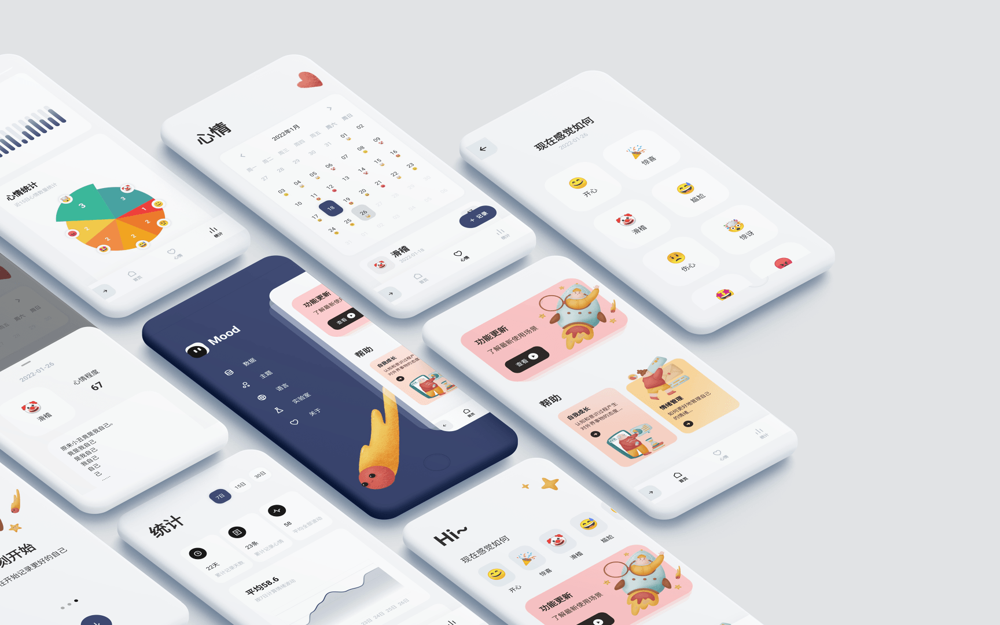
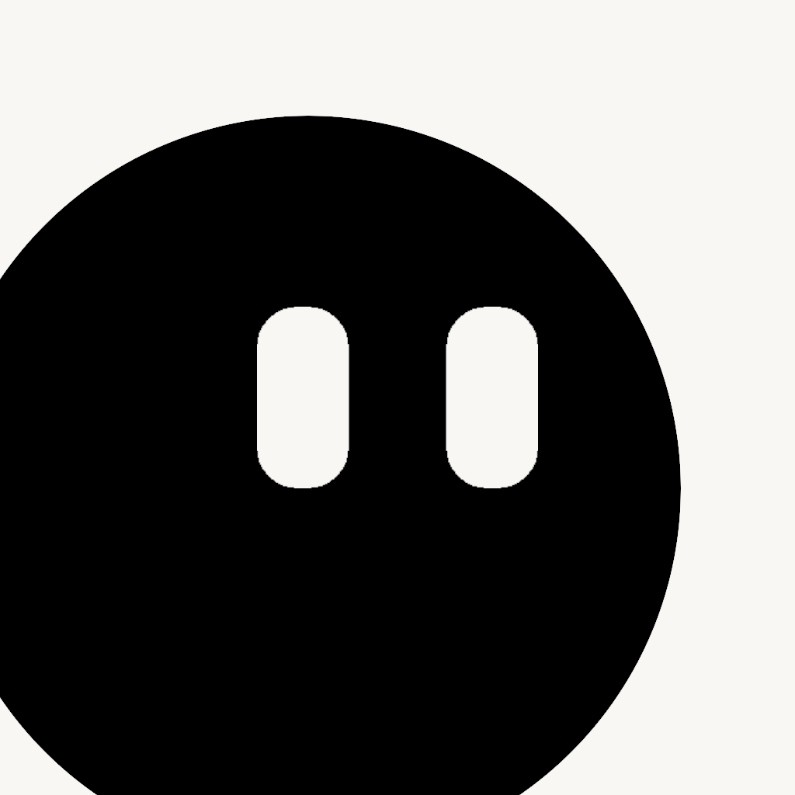

<p align="center">
  
</p>

<br/>

<h1 align="center"> 
   Mood Example

  [](https://stars.medv.io/AmosHuKe/Mood-Example)
</h1> 

<p align="center">
  <a target="_blank" href="/CHANGELOG.md"></a> 
  <a target="_blank" href="https://flutter.dev/"></a> 
  <a target="_blank" href="https://dart.dev/"></a> 
  <a target="_blank" href="https://github.com/AmosHuKe/Mood-Example/blob/main/LICENSE"></a> 
</p> 

<sub>

- [简介](#-简介)

- [相关网站](#-相关网站)

- [功能](#-功能)

- [测试运行环境](#-测试运行环境)

- [开发环境](#️-开发环境)

  - [基本环境](#️-基本环境)

  - [国际化环境支持](#️-国际化环境支持)

- [启动](#-启动)

- [项目结构](#-项目结构)

- [常见问题](#️-常见问题)

- [Packages](#-Packages)

- [Illustration](#️-Illustration)

- [Design](#-Design)

- [License](#-License)

</sub>

<br/>

## 🐦 简介

`情绪记录` 样例工程  
管理自己的情绪，记录当下所见所想，以及其他`实验室`功能（不定时更新一些功能）  
运用 `Flutter` 的实践工程，主要目的是学习、实践。  
> 注意：由于是学习实践工程，所以重点在于学习，许多业务逻辑可能并不符合现实。  
> Emoji 因设备缘故，会存在不同样式。  


## 🌏 相关网站

> Flutter 官网（中文）：<a target="_blank" href="https://flutter.cn/">https://flutter.cn/</a>  
> Flutter 官网（英文）：<a target="_blank" href="https://flutter.dev/">https://flutter.dev/</a>  
> Packages (原始站点) ：<a target="_blank" href="https://pub.dev/">https://pub.dev/</a>  
> Packages (中国镜像) ：<a target="_blank" href="https://pub-web.flutter-io.cn/">https://pub-web.flutter-io.cn/</a>  


## ⭐ 功能

- [x] 国际化 i18n  
- [x] 多主题  
- [x] 深色模式  
- [x] 本地数据管理  
- [x] 路由管理  
- [x] 状态管理  
- [x] 集成测试  
- [x] 情绪记录  
- [x] 图表统计  
- [x] Excel 导入导出  
- [x] 无障碍支持 (Semantics)  
- [x] Web 访问  
- [x] 解锁认证（锁屏密码、生物特征识别）  
- [x] 本地通知  
- [x] 动画  
- [x] 实验室（占用 APP 大部分包体积，源码位置查看项目结构）  
  - [x] uniapp 小程序（UniMPSDK v3.98）  
  - [x] 3D 城市（obj 格式）  
  - [x] 游戏合集（Bonfire, Flame）  
  - [x] FFI 异步调用 C/C++  
……


## 📱 测试运行环境

| 环境 | 支持版本 |  
| --- | --- |  
| Android | 最低：Android 5.0 (API 21) |  
| iOS | 最低：iOS 12.4 |  


## 🛠️ 开发环境

### 🛠️ 基本环境  

> Windows  
```
[√] Flutter (Channel stable, 3.19.0, on Microsoft Windows [版本 10.0.22621.3007], locale zh-CN)
[√] Android toolchain - develop for Android devices (Android SDK version 34.0.0)
[√] Visual Studio - develop Windows apps (Visual Studio Community 2022 17.7.5)
[√] Android Studio (version 2022.3)
[√] IntelliJ IDEA Ultimate Edition (version 2023.3)
[√] VS Code (version 1.86.2)
```  

> macOS  
```
[✓] Flutter (Channel stable, 3.19.0, on macOS 14.0 23A344 darwin-x64, locale zh-Hans-CN)
[✓] Android toolchain - develop for Android devices (Android SDK version 34.0.0)
[✓] Xcode - develop for iOS and macOS (Xcode 15.2)
[✓] Android Studio (version 2021.3)
[✓] VS Code (version 1.86.1)
```  


### 🛠️ 国际化环境支持  

安装编辑器插件：`Flutter Intl`  
> Visual Studio Code: [Flutter Intl](https://marketplace.visualstudio.com/items?itemName=localizely.flutter-intl)   
> IntelliJ / Android Studio: [Flutter Intl](https://plugins.jetbrains.com/plugin/13666-flutter-intl)  

```sh
# 插件指令

# 初始化
Flutter Intl: Initialize

# 添加 Locale
Flutter Intl: Add locale

# 删除 Locale
Flutter Intl: Remove locale

等等...
```  

使用 `Flutter Intl: Add locale` 输入 `国际化 (i18n) 地区对照语言码`，如简体中文：`zh_CN`，插件会自动在 `lib/l10n` 目录下生成对应的 `arb` 文件，我们只需要在 `arb` 文件中进行翻译。  
`arb` 翻译工作完成后，将对应的语言添加到 `lib/config/language.dart` 内。  
即可 `适配设备首选语言` 以及 `在应用语言设置内进行切换`。  

```sh
├── lib/
│   ├── config/
│   │   └── language.dart   # 语言配置
│   ├── generated/          # intl 语言包生成的文件夹（不用编码，使用 Flutter Intl 插件自动生成）
│   ├── l10n/               # intl 语言包
│   │   └──intl_zh_CN.arb   # 如 简体中文：zh_CN
......
```

iOS 支持语言本地化还需要在 `ios/Runner/Info.plist` 进行如下编辑。
```
<key>CFBundleLocalizations</key>
<array>
    <string>en</string>
    <string>zh_CN</string>
    ...
</array>
```


## 🎉 启动

在 [开发环境](#%EF%B8%8F-%E5%BC%80%E5%8F%91%E7%8E%AF%E5%A2%83) 支持的情况下  

```sh
# 克隆项目
$ git clone https://github.com/AmosHuKe/Mood-Example.git

# 获取依赖
$ flutter pub get

# 启动项目或相关 IDE 启动
$ flutter run

# 更多启动模式
$ flutter run --debug/release/profile/test

# 清理构建缓存
$ flutter clean

# 集成测试
$ flutter test integration_test/app_test.dart
```


## 📑 项目结构

```sh
├── android/                                        # Android 工程文件 
│   ├── app/                      
│   │   ├── libs/                                   # 包含 UniMPSDK 依赖库
│   │   └── src/
│   │       └── main/                 
│   │           ├── assets/                         # 包含 UniMPSDK 内容
│   │           │   ├── apps/                       # 包含 UniMPSDK 的 uniapp 小程序
│   │           │   ├── data/                       # 包含 UniMPSDK 内容
│   │           └── kotlin/                         
│   │               └── com/                     
│   │                   └── example/   
│   │                       └── moodexample/
│   │                           └── MainActivity.kt # Flutter 的 Android 默认入口
│   └── CMakeLists.txt                              # CMake（目前编译 FFI 需要的文件）
├── assets/                                         # 静态资源文件
├── build/                                          # 编译或运行后产物
├── integration_test/                               # 集成测试
│   └── app_test.dart                               # 集成测试入口 用例
├── ios/                                            # iOS 工程文件
│   ├── Classes/                                    # Classes（目前存放 FFI 相关文件）
│   │   ├── include/
│   │   │   └── dart_native_api                     # DartNativeAPI 接口库
│   │   └── ffi.cpp                                 # FFI 逻辑测试
│   ├── Runner/                                     # Runner
│   │   ├── UniMPSDK/                               # 包含 UniMPSDK 内容
│   │   │   ├── Apps/                               # 包含 UniMPSDK 的 uniapp 小程序
│   │   │   └── Core/                               # 包含 UniMPSDK 依赖库
│   │   ├── AppDelegate_UniMPSDK.swift              # 调用 UniMPSDK 主要逻辑代码
│   │   ├── AppDelegate.swift                       # Flutter 的 iOS 默认入口
│   │   ├── Info.plist                              # 项目配置
│   │   └── Runner-Bridging-Header.h                # 依赖库引入
│   └── Podfile                                     # 依赖配置
├── lib/                                            # 工程相关文件（主要编码）
│   ├── common/                                     # 公共相关
│   │   ├── local_auth_utils.dart                   # 本地认证（生物特征识别）
│   │   ├── notification.dart                       # 本地通知
│   │   ├── utils_intl.dart                         # 国际化工具
│   │   └── utils.dart                              # 工具
│   ├── config/                                     # 配置
│   │   ├── language.dart                           # 语言配置
│   │   └── multiple_themes.dart                    # 多主题配置
│   ├── db/                                         # 数据存储相关
│   │   ├── database/                               # sqflite 数据表配置
│   │   ├── db.dart                                 # sqflite 数据库相关
│   │   └── preferences_db.dart                     # shared_preferences 数据相关
│   ├── generated/                                  # intl 语言包生成的文件夹（不用编码，使用 Flutter Intl 插件自动生成）
│   ├── l10n/                                       # intl 语言包
│   ├── models/                                     # 数据模型
│   ├── providers/                                  # 业务状态逻辑
│   ├── services/                                   # 数据服务
│   ├── themes/                                     # 主题相关
│   │   ├── multiple_themes_mode/                   # 多主题配色
│   │   │   └── theme_default.dart.dart             # 多主题默认配色
│   │   └── app_theme.dart                          # 主题基础
│   ├── views/                                      # 视图
│   │   ├── home/                                   # 首页
│   │   ├── menu_screen/                            # 侧边设置栏
│   │   ├── mood/                                   # 心情页
│   │   ├── onboarding/                             # 用户引导页
│   │   ├── settings/                               # 侧边设置栏-其他页面组件（实验室等）
│   │   │   └── laboratory/                         # 实验室
│   │   │       ├── 3d/                             # 3D 城市
│   │   │       ├── ffi/                            # ffi 测试
│   │   │       ├── game/                           # 游戏合集
│   │   │       ├── unimp_miniapps/                 # uniapp 小程序
│   │   │       └── index.dart                      # 实验室首页
│   │   ├── statistic/                              # 统计页
│   │   └── web_view/                               # WebView
│   ├── widgets/                                    # 通用组件相关
│   ├── application.dart                            # 主应用
│   ├── home_screen.dart                            # 主应用导航相关
│   ├── init.dart                                   # 初始化相关
│   ├── main.dart                                   # 主应用入口
│   └── routes.dart                                 # 路由管理
├── test/                                           # 测试
├── .gitignore                                      # Git 提交仓库忽略文件配置
├── .metadata                                       # 当前 workspace 配置记录
├── analysis_options.yaml                           # Dart 语言代码规范
├── pubspec.lock                                    # 依赖生成的文件
└── pubspec.yaml                                    # 核心配置文件（项目配置、依赖等）
```


## 🤔️ 常见问题  

<!-- ### **Q: 在 iOS 无法打开 uni小程序或无法使用 UniMPSDK**  
<details>
<summary>点击展开</summary>

> 这是由于 UniMPSDK 官方提供的依赖超过大小限制。  
> 本项目为了 iOS 端主要功能不受限，剔除了 UniMPSDK 中 Core/Libs 所有库。  
> 详细目录说明可查看`项目结构`说明  
> 跟着以下步骤可以恢复正常使用：  

1、下载 UniMPSDK_iOS 库（如链接失效，请麻烦联系我）  
* 链接: https://pan.baidu.com/s/1j1FgMfiFTwg5H8i5Rr0m_A 提取码: qbit  

2、将 UniMPSDK 中 Core/Libs 所有库添加到项目中，具体如下：
* 使用 Xcode 打开 Mood-Example/ios 目录 -->
<!-- 
* 选择 Runner -> TARGETS(Runner) -> Build Phases -> Link Binary With Libraries  
* 点击 + 号并选择 Add Other... 找到下载好的 UniMPSDK 目录
* 全选 UniMPSDK/Core/Libs 中所有库，完成添加   
-->
<!-- * 右键项目目录 Runner/UniMPSDK/Core 文件夹  
* 点击 Add Files to "Runner"...  
* 找到下载的库，选中 UniMPSDK/Core/Libs 文件夹，  
  勾选 Destination: Copy items if needed，  
  选择 Added folders: Create groups，  
  点击 Add 添加完成  

3、调用库并使用代码，具体如下：  
* 解除 ios/Runner/Runner-Bridging-Header.h 中 #import "DCUniMP.h" 的注释  
* 将 ios/Runner/AppDelegate_UniMPSDK.swift 中的所有逻辑代码复制到 ios/Runner/AppDelegate.swift 中  

4、完成，启动 iOS，测试打开小程序  

5、其他
* [官方 UniMPSDK iOS 集成教程](https://nativesupport.dcloud.net.cn/UniMPDocs/UseSdk/ios)  
</details> -->

### **Q: 小程序无法使用视频、地图等**  
<details>
<summary>点击展开</summary>

这是因为项目中只集成了核心基础库（因为仅作为集成演示），  
许多功能库（比如视频、地图、分享、支付、登录、直播 pusher 等 SDK）没有集成，  

如果你需要这些功能就需要自行集成。

比如在 iOS 中集成，需要先下载  [UniMP_iOS_SDK](https://nativesupport.dcloud.net.cn/UniMPDocs/SDKDownload/ios.html) ，  
然后你会看见如下结构：

```
├── UniMPSDK/
│   ├── Core/         # 核心库
│   ├── Features/     # 非核心功能库
......
```

之后根据以下两个官方教程进行集成：

- [iOS 核心库集成教程（可以看看，非核心库集成方式也是一致）](https://nativesupport.dcloud.net.cn/UniMPDocs/UseSdk/ios.html)
- [iOS 功能模块集成（包含所有库的教程和说明）](https://nativesupport.dcloud.net.cn/UniMPDocs/UseModule/ios/ios.html)

</details>

### **Q: 在 APP 关闭后，通知失效**  
<details>
<summary>点击展开</summary>

> 在确认应用开启了通知的情况下，关闭 APP 后依旧无法通知。  
> 这是因为部分品牌 Android 默认使用了电池节能策略。  

解决：关闭应用的电池节能策略，并打开自启动

</details>


## 📦 Packages  

感谢开源  

| Packages | License |  
|---|---|  
| [bonfire](https://pub.dev/packages/bonfire) | [MIT License](https://pub.dev/packages/bonfire/license) |  
| [card_swiper](https://pub.dev/packages/card_swiper) | [MIT License](https://pub.dev/packages/card_swiper/license) |  
| [cupertino_icons](https://pub.dev/packages/cupertino_icons) | [MIT License](https://pub.dev/packages/cupertino_icons/license) |  
| [ditredi](https://pub.dev/packages/ditredi) | [MIT License](https://pub.dev/packages/ditredi/license) |  
| [excel](https://pub.dev/packages/excel) | [MIT License](https://pub.dev/packages/excel/license) |  
| [fluro](https://pub.dev/packages/fluro) | [MIT License](https://pub.dev/packages/fluro/license) |  
| [file_picker](https://pub.dev/packages/file_picker) | [MIT License](https://pub.dev/packages/file_picker/license) |  
| [flutter_slidable](https://pub.dev/packages/flutter_slidable) | [MIT License](https://pub.dev/packages/flutter_slidable/license) |  
| [flutter_zoom_drawer](https://pub.dev/packages/flutter_zoom_drawer) | [MIT License](https://pub.dev/packages/flutter_zoom_drawer/license) |  
| [flutter_screen_lock](https://pub.dev/packages/flutter_screen_lock) | [MIT License](https://pub.dev/packages/flutter_screen_lock/license) |  
| [flutter_smart_dialog](https://pub.dev/packages/flutter_smart_dialog) | [MIT License](https://pub.dev/packages/flutter_smart_dialog/license) |  
| [flutter_tilt](https://pub.dev/packages/flutter_tilt) | [MIT License](https://pub.dev/packages/flutter_tilt/license) |  
| [provider](https://pub.dev/packages/provider) | [MIT License](https://pub.dev/packages/provider/license) |  
| [remixicon](https://pub.dev/packages/remixicon) | [MIT License](https://pub.dev/packages/remixicon/license) |  
| [awesome_notifications](https://pub.dev/packages/awesome_notifications) | [Apache-2.0 License](https://pub.dev/packages/awesome_notifications/license) |  
| [flutter_screenutil](https://pub.dev/packages/flutter_screenutil) | [Apache-2.0 License](https://pub.dev/packages/flutter_screenutil/license) |  
| [flutter_timezone](https://pub.dev/packages/flutter_timezone) | [Apache-2.0 License](https://pub.dev/packages/flutter_timezone/license) |  
| [table_calendar](https://pub.dev/packages/table_calendar) | [Apache-2.0 License](https://pub.dev/packages/table_calendar/license) |  
| [sqflite](https://pub.dev/packages/sqflite) | [BSD-2-Clause License](https://pub.dev/packages/sqflite/license) |  
| [vibration](https://pub.dev/packages/vibration) | [BSD-2-Clause License](https://pub.dev/packages/vibration/license) |  
| [animations](https://pub.dev/packages/animations) | [BSD-3-Clause License](https://pub.dev/packages/animations/license) |  
| [fl_chart](https://pub.dev/packages/fl_chart) | [BSD-3-Clause License](https://pub.dev/packages/fl_chart/license) |  
| [flutter_lints](https://pub.dev/packages/flutter_lints) | [BSD-3-Clause License](https://pub.dev/packages/flutter_lints/license) |  
| [intl](https://pub.dev/packages/intl) | [BSD-3-Clause License](https://pub.dev/packages/intl/license) |  
| [local_auth](https://pub.dev/packages/local_auth) | [BSD-3-Clause License](https://pub.dev/packages/local_auth/license) |  
| [path_provider](https://pub.dev/packages/path_provider) | [BSD-3-Clause License](https://pub.dev/packages/path_provider/license) |  
| [share_plus](https://pub.dev/packages/share_plus) | [BSD-3-Clause License](https://pub.dev/packages/share_plus/license) |  
| [shared_preferences](https://pub.dev/packages/shared_preferences) | [BSD-3-Clause License](https://pub.dev/packages/shared_preferences/license) |  
| [webview_flutter](https://pub.dev/packages/webview_flutter) | [BSD-3-Clause License](https://pub.dev/packages/webview_flutter/license) |  


## 🖼️ Illustration

<a target="_blank" href="https://icons8.com/illustrations/style--woolly"></a>  
Illustration by <a target="_blank" href="https://icons8.com/illustrations/author/5ed4dd0e01d03600149fec60">Svetlana Tulenina</a> from <a target="_blank" href="https://icons8.com/illustrations">Ouch!</a>  


## 🎨 Design

Design by [Mindfulness Concept App](https://dribbble.com/shots/15733031-Mindfulness-Concept-App) from Bogusław Podhalicz.  


## 📄 License

[](https://github.com/AmosHuKe/Mood-Example/blob/main/LICENSE)  
Open sourced under the BSD-3-Clause license.  
根据 BSD-3-Clause 许可证开源。  
© AmosHuKe
